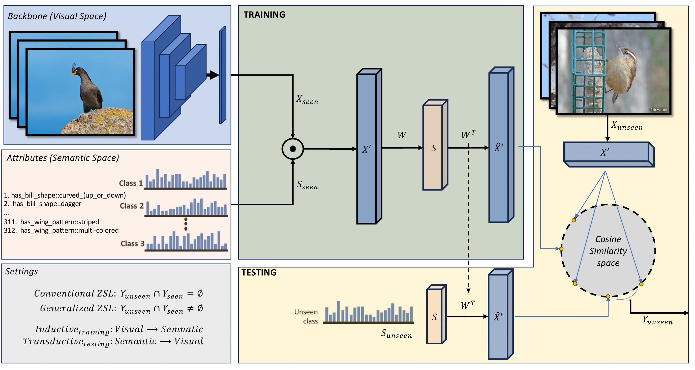

# An Integral Projection-based Semantic Autoencoder for Zero-Shot Learning
### [[arXiv]](TBD)


William Heyden, Habib Ullah, Muhammad Salman Siddiqui, and Fadi Al Machot

### Paper Abstract
Zero-shot Learning (ZSL) classification categorizes or predicts classes (labels) that are not included in the training set (unseen classes). Recent works proposed different semantic autoencoder (SAE) models where the encoder embeds a visual feature vector space into the semantic space and the decoder reconstructs the original visual feature space. The objective is to learn the embedding by leveraging a source data distribution, which can be applied effectively to a different but related target data distribution. Such embedding-based methods are prone to domain shift problems and seen biases. We propose an integral projection-based semantic autoencoder (IP-SAE) where an encoder projects a visual feature space concatenated with the semantic space into a latent representation space. We force the decoder to reconstruct the visual-semantic data space. Due to this constraint, the visual-semantic projection function preserves the discriminatory data included inside the original visual feature space. The enriched projection forces a more precise reconstitution of the visual feature space invariant to the domain manifold. Consequently, the learned projection function is less domain-specific and alleviates the domain shift problem. Our proposed IP-SAE model consolidates a symmetric transformation function for embedding and projection and thus, it provides transparency for interpreting generative applications in ZSL. Therefore, in addition to outperform state-of- the-art methods considering four benchmark datasets, our analytical approach allows us to investigate distinct characteristics of generative-based methods in the unique context of zero-shot inference.



## IP-SAE Tutorial
This repository contains a Python application that launches a graphical user interface (GUI) for the IP-SAE method.

## Project Structure
```
.
├── main.py                 # Entry point – this is the file you run
├── requirements.txt        # External Python dependencies
|
├── Conventional_ZSL.py     # Example for conventional zero-shot learning setting
├── Generalized_ZSL.py      # Example for generalized zero-shot learning setting
├── sae_helper.py           # Helper functions, including Sylvester solver.
├── figures.py              # Visualizations
└── load_data.py            # Loading and preperation of the data.
```


## Requirements
For training and testing
* Python 3.10+
* Tkinter

## How to run the App
Follow the steps below to run the application on your computer.
---
### 1. Get the Project Files

**Option A – Using Git**

```bash
git clone https://github.com/william-heyden/IP-SAE.git
cd IP-SAE
```
**Option B – Download as ZIP**
	1.	Click the Code button on this page
	2.	Select Download ZIP
	3.	Extract the folder
	4.	Open a terminal (or command prompt) inside the extracted folder

### 2. Install Dependencies
```bash
pip install -r requirements.txt
```
### 3. Run the Application
```bash
python main.py
```
## Datasets
| **Dataset** |
| AWA2    |
| CUB     |
| SUN     |
[link to datasets](https://www.kaggle.com/datasets/pokiajh/xlsa17)
